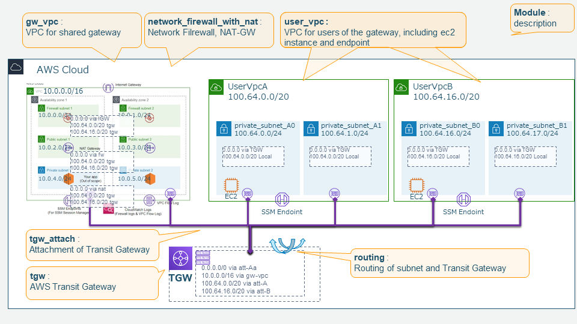

# Managed with domain filtering for outbound traffic from AWS VPC

## Overview

1. [To deploy Network Firewall on one VPC](01_one_vpc)

2. [To deploy VPCs connected Transit Gateway with Network Firewall as common gateway](02_via_tgw )

